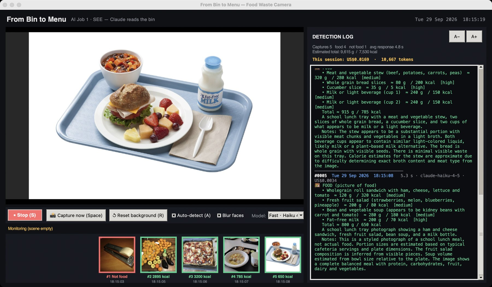
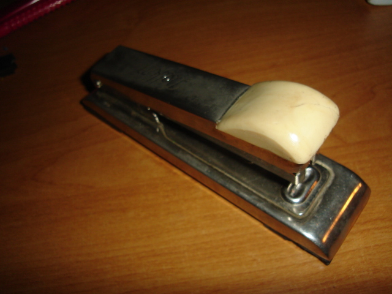
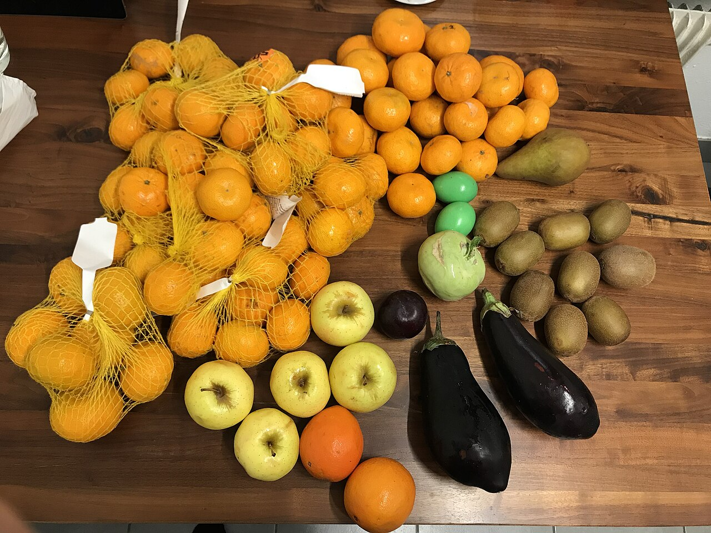
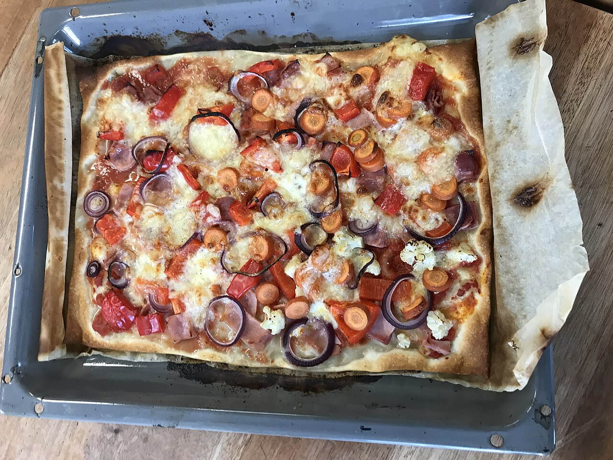
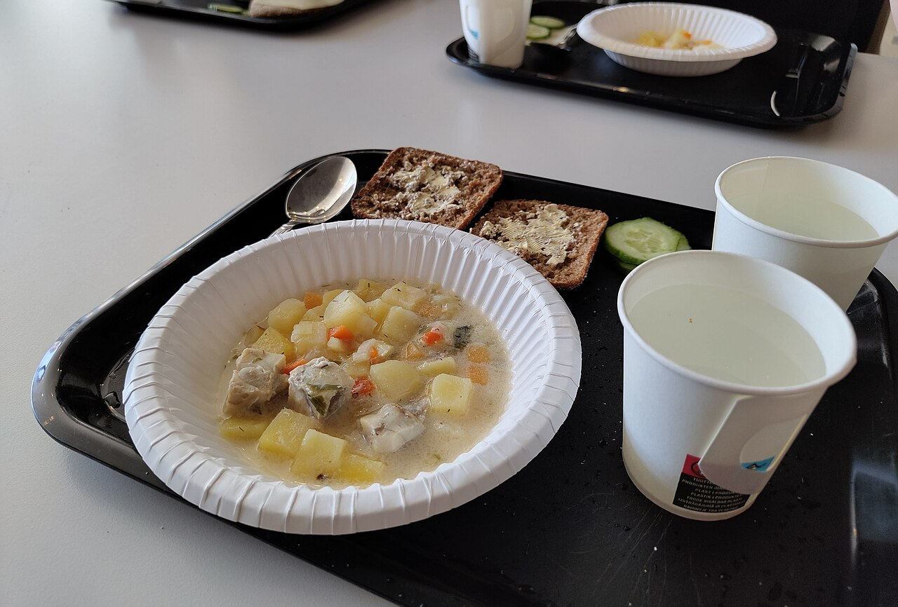
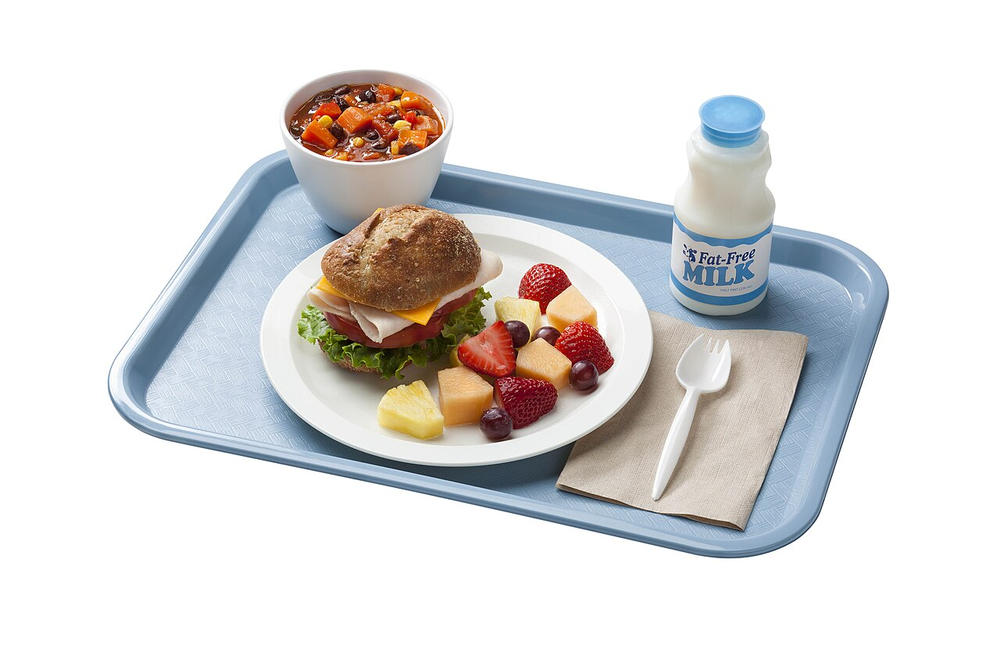

# From Bin to Menu — Food Waste Camera (AI Job 1 · SEE)

Opens the Mac camera. When a new object is placed in front of it and held still for about 1 second, a photo is taken automatically and sent to Claude:
- **Food** → each item is listed with an estimated weight (g) and energy (kcal)
- **Not food** → Claude says what it detected and marks it as "NOT FOOD"

Food is recognised wherever it appears — on a tray, in a bin, held in a hand, packaged, or as a picture of food on a phone or screen.

Layout: the live camera view on the left, a strip of photo icons below it where each new photo slides in from the right (swipe or drag the strip to look back at older photos; click an icon for the full photo and details), and a detection log with date, time and response time on the right. Drag the divider between them to resize the log; A− / A+ (or ⌘− / ⌘+) change the log text size.

**Privacy:** faces are detected on-device with Apple's Vision framework and blurred in the live view, in saved photos, and before any image is sent to Claude.

## Screenshot



The app analysing five sample photos with **Claude Haiku 4.5** (the default model). The results below are the real responses shown in the screenshot; the sample photos were fed in as the camera image.

| # | Sample photo | Result | Estimated total | Response | Cost |
|---|---|---|---|---|---|
| 1 |  | 🚫 **Not food** — "Detected a stapler" | — | 2.6 s | US$0.0024 |
| 2 |  | 🍱 Food — oranges, apples, pears, eggplants and more (8 items) | 6,700 g · 2,895 kcal | 5.9 s | US$0.0040 |
| 3 |  | 🍱 Food — sheet pizza | 1,200 g · 3,200 kcal | 3.8 s | US$0.0031 |
| 4 |  | 🍱 Food — meat and vegetable stew, bread, cucumber, milk | 915 g · 785 kcal | 6.3 s | US$0.0039 |
| 5 |  | 🍱 Food (picture of food) — sandwich, fruit salad, bean soup, milk | 800 g · 650 kcal | 5.3 s | US$0.0034 |

These are Claude's visual estimates, not measurements, and they have not been checked against a scale — photo 2, for example, is a heap of produce whose weight is hard to judge from one angle. Calibrating the estimates against a kitchen scale is the Week 1–3 step in the project plan.

## Install and run
```bash
pip3 install -r requirements.txt
python3 bin_to_menu.py
```
**API key:** create one at [platform.claude.com](https://platform.claude.com) (Settings → API Keys), then put it in a `.env` file next to `bin_to_menu.py` (this file is git-ignored):
```
ANTHROPIC_API_KEY=sk-ant-...
# Only needed if your key is not scoped to a workspace (Settings → Workspaces):
ANTHROPIC_WORKSPACE_ID=wrkspc_...
```
Alternatively, `export ANTHROPIC_API_KEY=sk-ant-...` in the terminal before starting.
On first launch macOS asks for camera permission. If it doesn't, allow Terminal (or VS Code) under System Settings → Privacy & Security → Camera.

Options: `--camera 1` uses another camera (e.g. iPhone Continuity Camera); `--no-save` does not store photos (privacy mode).
Model: choose in the **Model** dropdown — *Fast · Haiku 4.5* (default — cheapest and fastest), *Balanced · Sonnet 5*, *Accurate · Opus 5* (slowest, most expensive). The log shows the response time of every request.

Keys: S = start / stop camera (▶ Start / ■ Stop button) | Space = manual capture | R = reset background | A = toggle auto-detect | Q / Esc = quit

## Cost display
The log panel shows **This session** — the exact cost of every request so far, calculated from the token counts Claude returns (about US$0.0024–0.0036 per photo with Haiku 4.5; photos with more food items cost slightly more). Each log entry also shows its own cost. Anthropic has no API for reading the remaining credit balance; check it in the Console (Settings → Billing).

## Output
- `captures/` — captured photos
- `logs/detections.jsonl` — one record per detection (time, foods, grams, kcal, tokens, cost)

## Tips
- Start with the camera looking at an empty scene (a table or tray area); the program uses it as the background. Press R whenever the background changes.
- Each object is analysed once; remove it or add a new item to trigger another capture. Automatic captures are at least 3 s apart, and head movements are ignored, so sitting in front of the camera does not trigger captures.
- Grams and kcal are Claude's visual **estimates**, not measurements (see deck slide 7: Weeks 1–3 calibrate against a kitchen scale).

## Image credits

Sample photos from Wikimedia Commons, resized to 1280 px:

| File | Source | Author | License |
|---|---|---|---|
| `docs/images/tray_usda.jpg` | [School lunch tray MyPlate 20210810-FNS-UNC-0015.jpg](https://commons.wikimedia.org/wiki/File:School_lunch_tray_MyPlate_20210810-FNS-UNC-0015.jpg) | U.S. Department of Agriculture | Public domain |
| `docs/images/tray_finland.jpg` | [School lunch in ylästö school.jpg](https://commons.wikimedia.org/wiki/File:School_lunch_in_yl%C3%A4st%C3%B6_school.jpg) | Jukajuha | CC0 |
| `docs/images/waste_pizza.jpg` | [Pizza with food waste.jpg](https://commons.wikimedia.org/wiki/File:Pizza_with_food_waste.jpg) | PizzaToast | CC0 |
| `docs/images/waste_vegetables.jpg` | [Vegetables from a food retailer's container.jpg](https://commons.wikimedia.org/wiki/File:Vegetables_from_a_food_retailer%27s_container.jpg) | PizzaToast | CC0 |
| `docs/images/nonfood_stapler.jpg` | [Stapler "Delfin" 1.jpg](https://commons.wikimedia.org/wiki/File:Stapler_%22Delfin%22_1.jpg) | OFFset32 at Polish Wikipedia | Public domain |

